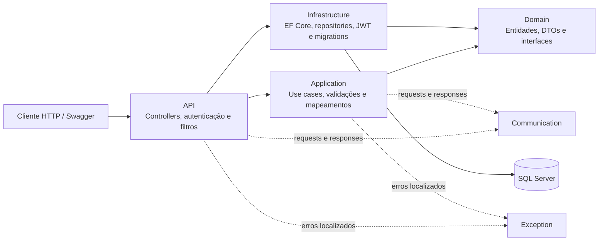

# MyRecipeBook API


Uma API REST para organizar receitas pessoais com autenticação, filtros de busca e isolamento dos dados por usuário. O projeto foi construído para exercitar decisões que aparecem em sistemas reais: separação em camadas, segurança, persistência relacional, validação, localização, migrations e testes automatizados de diferentes níveis.

Mais do que um CRUD, o MyRecipeBook demonstra como uma requisição atravessa contratos HTTP, casos de uso e abstrações do domínio até chegar ao SQL Server — sem acoplar a regra de aplicação à implementação do banco de dados.

## O que este projeto demonstra

- Arquitetura em camadas com responsabilidades bem definidas.
- Inversão de dependência por meio de interfaces no domínio.
- Autenticação JWT e validação do usuário ativo a cada token autenticado.
- Hash seguro de senhas com Argon2.
- Validação de entrada com FluentValidation.
- Persistência com Entity Framework Core e SQL Server.
- Evolução do schema com FluentMigrator.
- Mapeamento entre entidades, DTOs e respostas com Mapster.
- Mensagens localizadas em inglês, português e espanhol.
- Testes unitários, de validators e de integração com banco real em container.
- Documentação interativa com Swagger e suporte a Bearer Token.

## Funcionalidades implementadas

### Usuários e autenticação

- Cadastro de usuário.
- Login com e-mail e senha.
- Consulta do próprio perfil.
- Atualização de nome e e-mail.
- Alteração de senha com validação da senha atual.
- Emissão e validação de access token JWT.
- Rejeição de tokens inválidos, expirados ou associados a usuários inexistentes/inativos.
- Solicitação de recuperação de senha com geração e persistência de código.

### Receitas

- Cadastro, consulta, atualização e exclusão.
- Ingredientes, instruções ordenadas e tipos de prato.
- Consulta das seis receitas mais recentes, ordenadas por data de criação.
- Filtro opcional por termo, tempo de preparo e tipos de prato.
- Busca textual pelo título ou pelos ingredientes.
- Acesso restrito às receitas pertencentes ao usuário autenticado.

## Arquitetura

O projeto usa uma arquitetura em camadas inspirada nos princípios de Clean Architecture. A API atua como composition root; a Application coordena os casos de uso; o Domain mantém entidades, DTOs e contratos; e a Infrastructure implementa persistência, identidade e segurança.



### Responsabilidade de cada projeto

| Projeto | Responsabilidade |
|---|---|
| `MyRecipeBook.Api` | Endpoints, autenticação JWT, localização, Swagger, conversores JSON e tratamento global de exceções. |
| `MyRecipeBook.Application` | Casos de uso, validators e mapeamentos entre contratos e domínio. |
| `MyRecipeBook.Domain` | Entidades, enums, DTOs e interfaces que representam as regras e dependências centrais. |
| `MyRecipeBook.Infrastructure` | Entity Framework Core, repositories, SQL Server, Argon2, JWT e FluentMigrator. |
| `MyRecipeBook.Communication` | Requests, responses e enums expostos pela API. |
| `MyRecipeBook.Exception` | Exceções de negócio e resources localizados. |

### Estrutura do repositório

```text
MyRecipeBook/
├── src/
│   ├── Backend/
│   │   ├── MyRecipeBook.Api/
│   │   ├── MyRecipeBook.Application/
│   │   ├── MyRecipeBook.Domain/
│   │   └── MyRecipeBook.Infrastructure/
│   └── Shared/
│       ├── MyRecipeBook.Communication/
│       └── MyRecipeBook.Exception/
├── tests/
│   ├── CommonTestUtilities/
│   ├── UseCases.Tests/
│   ├── Validators.Tests/
│   └── WebApi.Tests/
├── coverage.runsettings
└── MyRecipeBook.slnx
```

## Decisões técnicas relevantes

### Segurança e identidade

As senhas são armazenadas com Argon2. Os access tokens JWT possuem expiração e assinatura simétrica, sem tolerância adicional de relógio (`ClockSkew = 0`). Após validar a assinatura, a API também confirma no banco se o usuário continua ativo.

Os endpoints protegidos usam o usuário identificado pelo token para filtrar dados. Assim, conhecer o ID de uma receita não concede acesso a uma receita de outro usuário.

### Persistência e consultas

O Entity Framework Core é usado sobre SQL Server. Consultas somente de leitura aplicam `AsNoTracking`, e listagens projetam apenas os campos necessários em DTOs resumidos.

As entidades usam `Guid` versão 7. Para representar recência, entretanto, as receitas possuem `CreatedOn` em UTC e são ordenadas por essa propriedade, sem depender da ordenação de `uniqueidentifier` do SQL Server.

O filtro de receitas compõe a consulta de forma incremental:

- `CookTime`: igualdade com o tempo selecionado;
- `SearchTerm`: ocorrência no título **ou** em algum ingrediente;
- `DishTypes`: presença de pelo menos um dos tipos informados.

Os grupos preenchidos são combinados entre si, mantendo a consulta executada no banco.

### Migrations

O schema é versionado com FluentMigrator. As migrations pendentes são executadas automaticamente durante a inicialização da API, antes de ela começar a receber requisições.

### Localização e erros

O idioma é selecionado pelo header `Accept-Language`. Atualmente são suportados:

- `en` — idioma padrão;
- `pt-BR`;
- `es`.

Um filtro global transforma exceções da aplicação em respostas JSON consistentes, enquanto falhas de autenticação retornam mensagens específicas para token ausente, inválido ou expirado.

## Tecnologias

| Categoria | Tecnologia |
|---|---|
| Plataforma | .NET 10 / ASP.NET Core Web API |
| Banco de dados | SQL Server |
| ORM | Entity Framework Core 10 |
| Migrations | FluentMigrator 8 |
| Autenticação | JWT Bearer |
| Hash de senha | Argon2 |
| Validação | FluentValidation |
| Mapeamento | Mapster |
| Documentação | Swagger / OpenAPI |
| Testes | xUnit, Shouldly, Moq e Bogus |
| Integração | `WebApplicationFactory` e Testcontainers for .NET |
| Cobertura | Coverlet Collector |

## Endpoints

Todos os endpoints de receitas exigem autenticação.

| Método | Rota | Autenticação | Descrição |
|---|---|---:|---|
| `POST` | `/users` | Não | Cadastra um usuário. |
| `GET` | `/users` | Sim | Retorna o perfil do usuário autenticado. |
| `PUT` | `/users/profile` | Sim | Atualiza nome e e-mail. |
| `PUT` | `/users/password` | Sim | Altera a senha. |
| `POST` | `/authentication` | Não | Realiza login. |
| `POST` | `/authentication/password-recovery` | Não | Gera e persiste um código de recuperação. |
| `POST` | `/recipes` | Sim | Cadastra uma receita. |
| `GET` | `/recipes/{recipeId}` | Sim | Consulta uma receita por ID. |
| `PUT` | `/recipes/{recipeId}` | Sim | Atualiza uma receita. |
| `DELETE` | `/recipes/{recipeId}` | Sim | Exclui uma receita. |
| `GET` | `/recipes/recent` | Sim | Retorna até seis receitas recentes. |
| `POST` | `/recipes/filter` | Sim | Filtra receitas pelos critérios enviados. |

## Exemplos de requisição

### Cadastro de receita

```json
{
  "title": "Risoto de cogumelos",
  "ingredients": [
    "Arroz arbóreo",
    "Cogumelos",
    "Caldo de legumes"
  ],
  "instructions": [
    {
      "order": 1,
      "description": "Aqueça o caldo e refogue os cogumelos."
    },
    {
      "order": 2,
      "description": "Adicione o arroz e cozinhe incorporando o caldo aos poucos."
    }
  ],
  "dishTypes": ["Dinner"],
  "cookTime": "From30To60Minutes"
}
```

### Filtro de receitas

Todos os campos são opcionais. Uma request vazia retorna as receitas do usuário sem aplicar filtros adicionais.

```json
{
  "searchTerm": "cogumelos",
  "cookTime": "From30To60Minutes",
  "dishTypes": ["Dinner"]
}
```

## Como executar localmente

### Pré-requisitos

- [.NET 10 SDK](https://dotnet.microsoft.com/download/dotnet/10.0)
- SQL Server acessível pela aplicação
- Docker Desktop ou outro runtime compatível, caso queira executar os testes de integração

### 1. Clone e acesse o repositório

```bash
git clone <url-do-repositorio>
cd MyRecipeBook
```

### 2. Configure as variáveis de ambiente

Os valores abaixo são exemplos. Use uma chave JWT longa e mantenha credenciais fora do controle de versão.

PowerShell:

```powershell
$env:ConnectionStrings__DefaultConnection="Server=localhost,1433;Database=MyRecipeBook;User Id=sa;Password=SUA_SENHA;TrustServerCertificate=True"
$env:Jwt__SigningKey="SUA_CHAVE_SECRETA_LONGA_E_SEGURA"
$env:Jwt__ExpirationTimeMinutes="60"
```

Bash:

```bash
export ConnectionStrings__DefaultConnection="Server=localhost,1433;Database=MyRecipeBook;User Id=sa;Password=SUA_SENHA;TrustServerCertificate=True"
export Jwt__SigningKey="SUA_CHAVE_SECRETA_LONGA_E_SEGURA"
export Jwt__ExpirationTimeMinutes="60"
```

### 3. Restaure e execute

```bash
dotnet restore MyRecipeBook/MyRecipeBook.slnx
dotnet run --project MyRecipeBook/src/Backend/MyRecipeBook.Api
```

Em ambiente de desenvolvimento, o Swagger fica disponível em:

- `https://localhost:7170/swagger`
- `http://localhost:5290/swagger`

As migrations são aplicadas automaticamente durante o startup.

### Autenticação pelo Swagger

1. Cadastre um usuário em `POST /users` ou autentique-se em `POST /authentication`.
2. Copie o `accessToken` retornado.
3. Clique em **Authorize** no Swagger.
4. Informe apenas o token; o Swagger adiciona o prefixo `Bearer` automaticamente.

## Testes

A estratégia de testes separa responsabilidades e mantém os cenários legíveis:

- `Validators.Tests`: regras do FluentValidation.
- `UseCases.Tests`: comportamento da Application com dependências simuladas por Moq.
- `WebApi.Tests`: pipeline HTTP completo com autenticação, migrations e SQL Server real via Testcontainers.
- `CommonTestUtilities`: builders com Bogus e configurações compartilhadas de mocks.

Para executar toda a suíte a partir da raiz do repositório:

```bash
dotnet test MyRecipeBook/MyRecipeBook.slnx --settings MyRecipeBook/coverage.runsettings
```

> Os testes de integração exigem que o Docker esteja em execução. O SQL Server de teste é criado e descartado automaticamente pelo Testcontainers.

## Fluxo de uma requisição

O fluxo de filtro de receitas ilustra a separação adotada:

1. `RecipesController` recebe `RequestFilterRecipesJson`.
2. `FilterRecipesUseCase` converte o contrato HTTP em `RecipeFilterDto` do domínio.
3. `IRecipeReadOnlyRepository` representa a dependência exigida pela Application.
4. `RecipeRepository` compõe a consulta LINQ e a executa no SQL Server.
5. O repository projeta apenas `Id` e `Title` em `RecipeSummaryDto`.
6. O use case converte o resultado para `ResponseRecipesJson`.
7. O controller devolve `200 OK`.

Esse desenho mantém o controller enxuto, o caso de uso independente do EF Core e a infraestrutura substituível em testes unitários.

## Estado atual e próximos passos

O núcleo de usuários, autenticação e receitas está funcional e coberto por testes. O fluxo de recuperação de senha já gera e persiste códigos de verificação sem revelar se o e-mail está cadastrado. O envio do código por e-mail e a etapa de redefinição da senha permanecem como evolução planejada.

---

Este repositório foi desenvolvido como projeto de portfólio, com foco em backend .NET, qualidade de código, segurança e testes automatizados.
